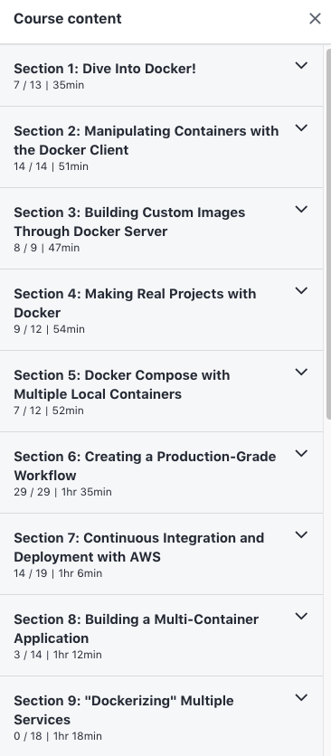

# Section Name Scraper for Udemy Courses

Suppose that you copy the following text into a file called `sample.txt`.



Then you can use `scrape_sections.py` to convert the data in that text into a `csv` file.

For example input and output, check out the files `sample.txt` and `Grider-Docker.csv` included in this repo.

## Example Usage

```
(venv) Jamess-Mac-mini:udemy-scraper Jim$ python3 scrape_sections.py

-------------------------
Udemy Course Info Scraper
-------------------------

We will convert the contents of 'sample_sections.txt' to a CSV file.
What should the name of the CSV file be?
For example, type 'file' to create 'file.csv'

Output file name:  Grider-Docker
File created!

```

# Also See

Also see `readme-lessons.md` for a "Lessons" Scraper
