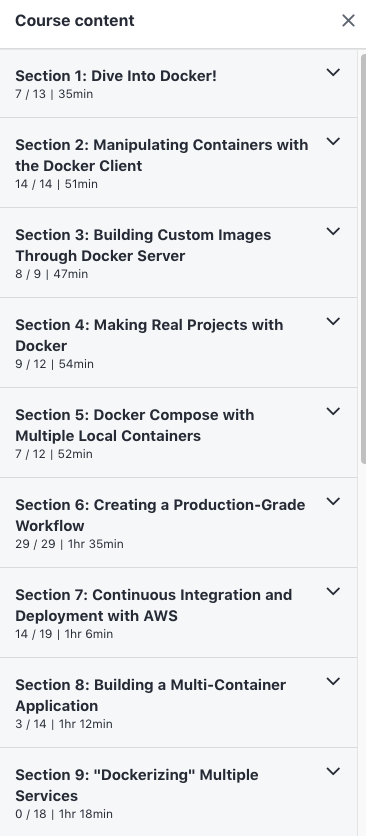

# Section Name Scraper for Udemy Courses

Suppose that you are taking a Udemy course. You copy the following text into a file called `./txt/sample_sections.txt`.



Then you can use `scrape_sections.py` (located in the `app` folder) to convert the data in that text into a `csv` file located in the `.csv/` folder.

For example input and output, check out the files `./txt/sample_sections.txt` and `./csv/Grider-Docker.csv` included in this repo.

## Example Usage

The following commands are being executed in a virtual envrionment that has `pandas` installed in it. (See `requirements.txt`).

```
> cd app
> python3 scrape_sections.py

-------------------------
Udemy Course Info Scraper
-------------------------

We will convert the contents of 'sample_sections.txt' to a CSV file.
What should the name of the CSV file be?
For example, type 'file' to create 'file.csv'

Output file name:  Grider-Docker
File created!

```

# Also See

Also see `readme-lessons.md` for a "Lessons" Scraper

# To Do

Clean up the `csv` files produced by `scrape_sections.py`. For instance, you can separate the section numbers from the section titles. You can also conver the time length column into minutes.
