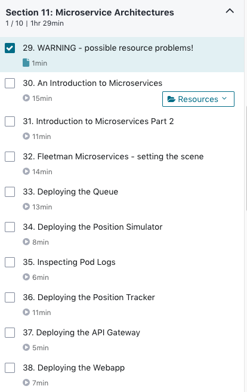

# Lesson Name Scraper for Udemy Courses

I like to keep track of my whereabouts in a Udemy course by having a `.csv` file containing the names and lengths of the lessons for a given section of a course.

Suppose that you copy the following text into a file called `sample.txt`.



Then you can use `scrape.py` to convert the data in that text into a `csv` file.

For example input and output, check out the files `sample.txt` and `section11.csv` included in this repo.

## Example Usage

```
> python scrape.py

-------------------------
Udemy Course Info Scraper
-------------------------

We will convert the contents of 'sample.txt' to a CSV file.
What should the name of the CSV file be?
For example, type 'section11' to create 'section11.csv'

Output file name:  section11

What is the name of the section?
Example: 11. Microservice Architectures

Section Name:  11. Microservice Architectures

File created!

```
